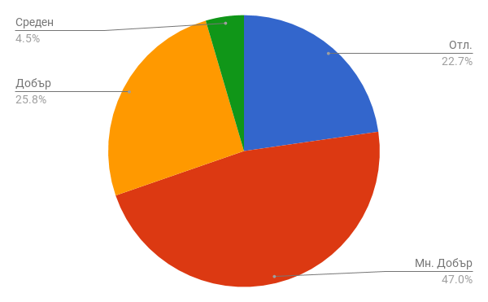
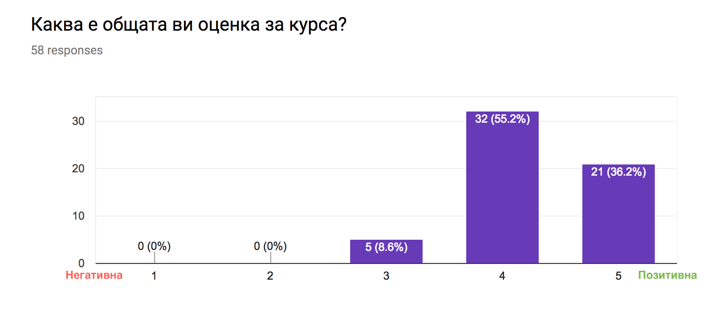
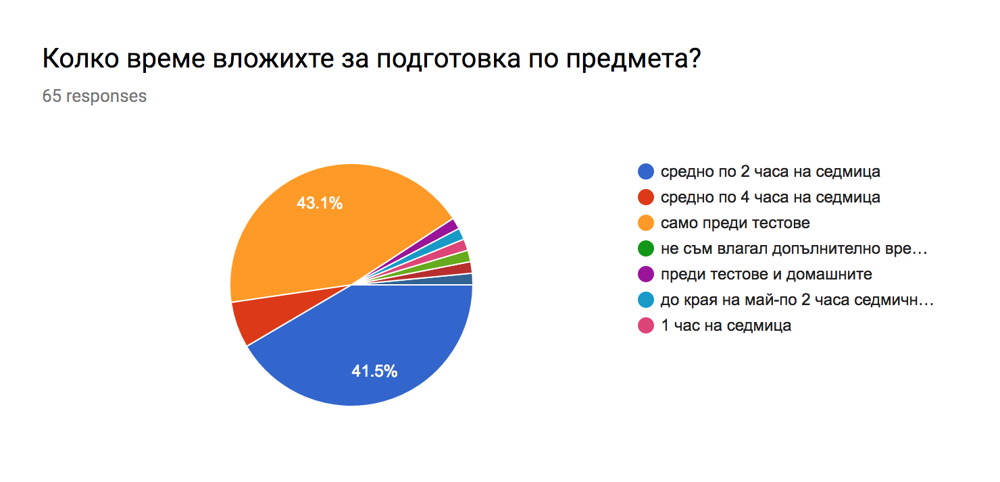
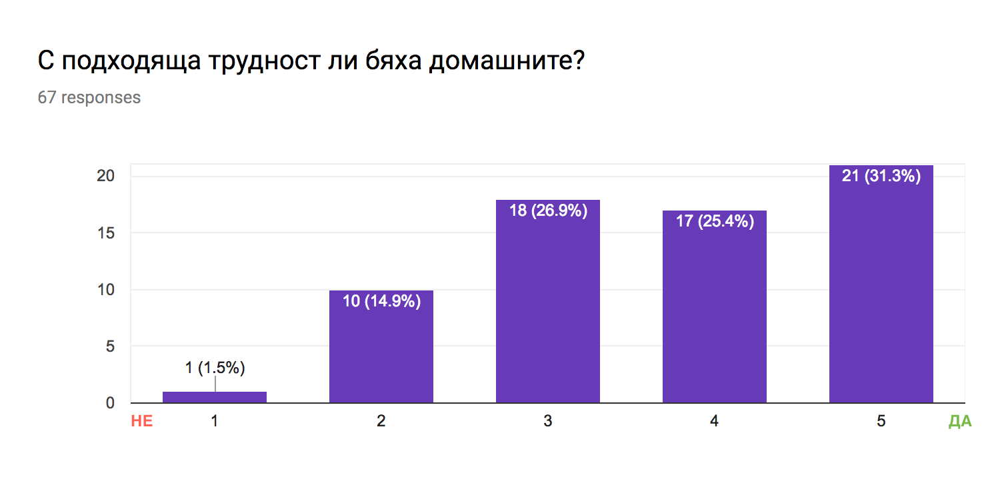
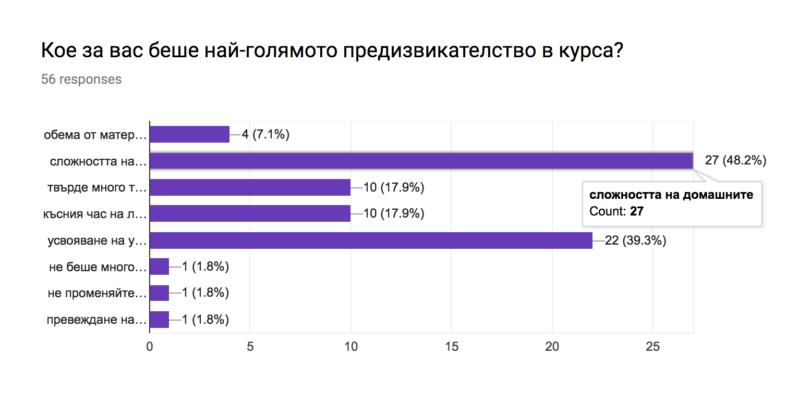
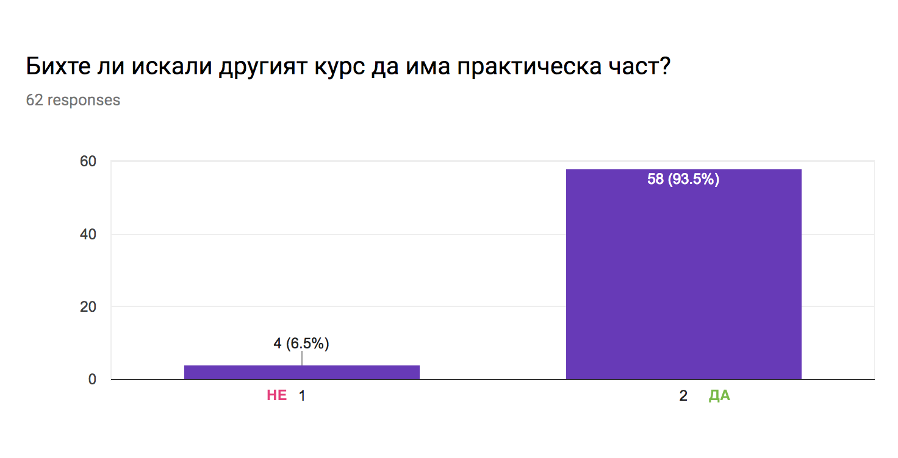
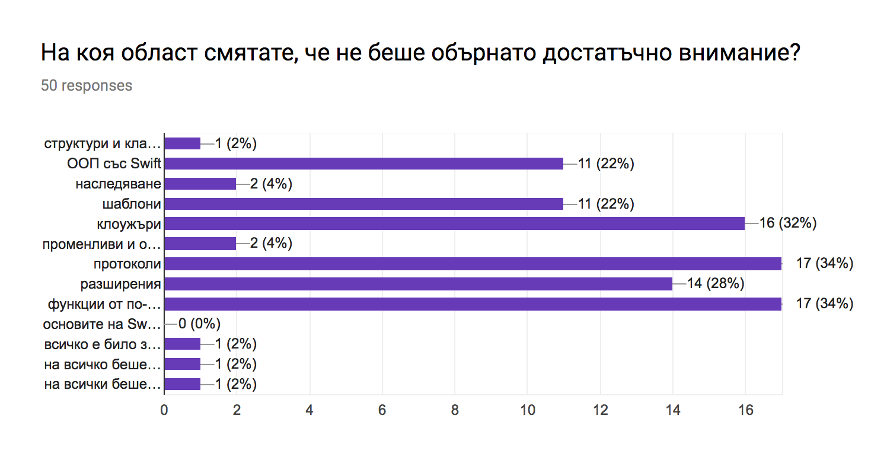
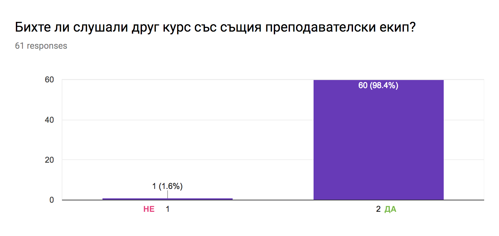
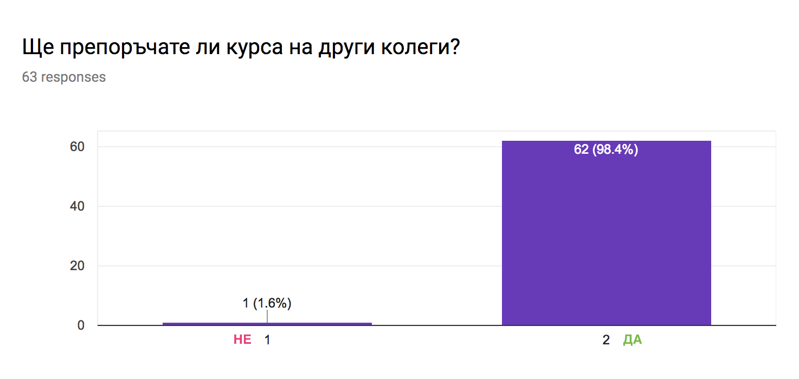
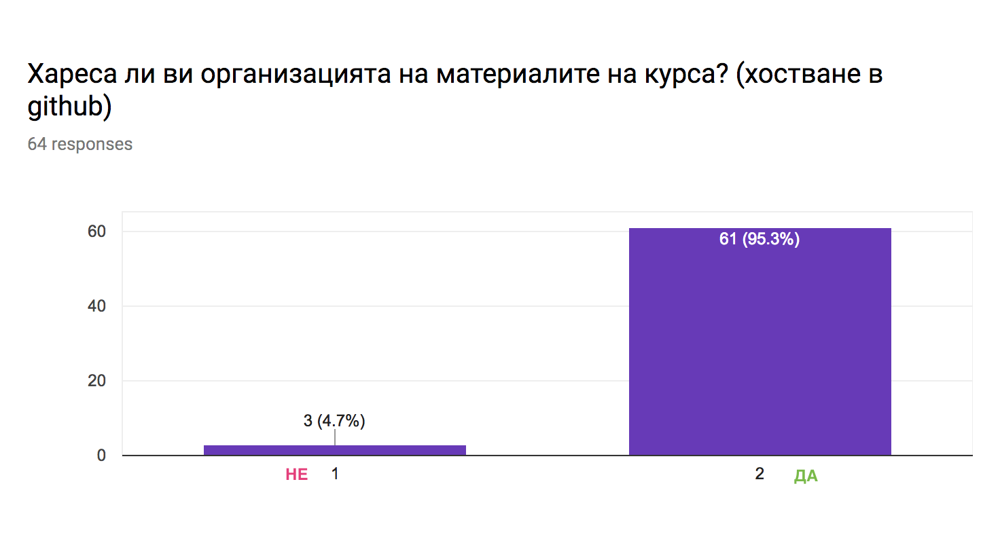

# Изводи от курса

На 24.06.2017г. се проведе вторият тест, който беше необходим, за да се финализира оценяването. Ще представим крайното процентно разпределение на успеха от курса. Ще обърнем повече внимание на отговорите на анкетата, които ни подсказаха какво мина добре и какво можеше да мине по-добре. На база на резултатите ние изготвихме списък с добри практики, които ще се опитаме да включим и в следващия курс, който очакваме да проведем.

## Резултати

След тежка борба с топлото време и трудния втори тест по "Програмиране със Swift" стана ясно, че повечето студенти са положили необходимите усилия, за да получат много добра или отлична оценка. Близо 70% от явилите се на тестовете получиха висока оценка, което показва, че са натрупали достатъчно знания, за да отговорят на нашите критерии за проверка на знанията.

На база на получените отговори, може да се заключи, че трудността на втория тест е по-голяма в сравнение с първия. Изглежда, че студентите са имали трудности със следните теми:

- клоужъри
- протоколи
- наследяване

Нека преминем директно към резултатите от анкетата.

## Анкета

Позволихме си да съберем обратна връзка от студентите, за да направим нелесния извод - какво мина добре по време на курса и какво не се получи толкова добре. Ние, също като студентите, се учим да  бъдем по-добри и това е моментът, в който се изправяме пред тях и се допитваме за тяхната оценка. 

__Учението е двустранен процес между преподавател и учащ се.__

Ето какво мислят курсистите за проведеното обучение през семестъра: (Попълването на анкетите беше направено преди получаване на финалната оценка, за да не бъде повлияно мнението на студентите от същата.)

Около 10% от всички взели участие в курса не са дали отговор, което навежда на мисълта, че тези студенти не са имали ясно мнение или са предпочели да замълчат. С уважение отправяме молба към тях да споделят своето мнение с цел подобряване нивото на курсовете във ФМИ. Над 90% от далите отговор са позитивно настроени относно курса. Този висок процент ни мотивира да направим и следващ курс, който се надяваме да бъде по-добър. Твърдо решени сме да търсим начини да ангажираме всички записали предмета по приятен и забавен начин, така че крайният резултат да е натрупани знания и приятно прекарано време в университета.

Запитахме студентите колко е времето, което те отделят за подготовка. Повече от ясно е, че колкото по-труден е даден курс, толкова повече внимание изисква той. На базата на времето, вложено за подготовка и добрите финални резултати, можем да заключим, че курсът е балансиран и не е от трудните курсове във ФМИ. 

Резултатите ни подсказват, че е необходима по-голяма ангажираност, за да може да има по-дълбоко и дълготрайно усвояване на материала. Това може да се постигне чрез въвеждането на задължителни домашни, оценката на които да допринася за формирането на крайното оценяване. Настоящият модел с оценяването на домашние работи и тяхната сложност се приема не толкова добре.

Очаквано затруднение се оказаха домашните и това е посочено ясно от студентите.

Въпреки това, повече от половината студенти смятат, че домашните са подходящи за нивото на курса. Но тук трябва да отчетем и факта, че студентите, които посещават изборната дисциплина, са от различни курсове. Поради това, че липсват статистически данни кои задачи от домашните са решени правилно и кои не, е трудно да се определи, кое е посочено като "трудно". Изводът за нас е, че домашните трябва да са повече на брой и да имат задължителен характер. По този начин ще можем да следим по-зорко какво е нивото на усвояване на учебния материал по време на семестъра. В допълнение, ще имаме възможност да подбираме задачи с правилната сложност, така че да поддържаме интереса на всички студенти и да не се губи вниманието на част от тях.

Интересен факт е, че почти 40% от студентите посочват като трудност "усвояването на учебния материал без индивидуални практически упражнения", т.е. без практика по предадените знания процесът на усвояване на материала е по-труден. Нашият извод е, че трябва да имаме повече практически занимания, които да позволяват на студентите да учат предадения теоритичен материал чрез практикуване на новите знания. Отичатаме като недостатък и късния час на лекциите, но се натъкваме и на разбиране сред някои студентите, които осъзнават и нашата ангажираност през работната седмица от 9ч. до 18ч. всеки работен ден. Не е за пренебрегване и обстоятелството, че някои колеги също работят, например - за да могат да осигурят средства за учението си.

Над 93% искат да има практическа част към следващите курсове. Това ни кара да се запитаме: "Какво можем да направим, за да има практическа част, когато броя на студентите е висок?". Предстои разработване на стратегия по този въпрос. За бъдещи курсове с ограничена бройка, обаче, ще имаме задължителна практическа част пред компютър.

Студентите определят следните четири области от материала като по-трудни, на които трябва да наблегнем в следващия курс:

- протоколи
- функции от по-висок ред
- клоужъри 
- разширения

За следващите издания на курса ще се опитаме да отделим повече време на посочените теми и да предложим повече практически задачи с тях. "Разширенията (extensions)" са нещо ново, типично за Swift, което може да бъде усвоено с повече практически задачи. Всички останали теми се срещат и в другите програмни езици под някаква форма, но изискват повече време за усвояване поради нетривилания им характер.

Близо 90% от студентите са доволни от задържането на интереса и отношението на преподавателския екип към тях. Това ни подсказва, че има още на къде да растем и да се развиваме, въпреки високите резултати. 

Малко над 98% от далите отговор студенти са готови да посетят и друг курс със същия преподавателски екип.

Също толкова ясно е и отношението на студентите относно това, дали биха предложили същия курс на други свои колеги. 

Голям е процентът (95%) на студентите, харесали новата ни инициатива  да споделяме материалите от курса в github. Това ни дава възможност да работим постоянно и съвместно със студентите над материалите. Те могат да задават върпоси и да ни подсказват какво може да се подобри или какво още липсва в лекциите, така че същите да са достъпни и разбираеми.

Положителна страна е това, че изработените материали, които имаме, остават достъпни и свободни в интернет пространството. Ние ще се стараем да ги поддържаме обновени за следващите курсове, като стъпваме на вече изградената основа.

__Тук е моментът да отправим своите благодарности към всички, които са допринесли за подобряването на записките по курса!__

А ето и поглед над финалните изводи, които направихме, отчитайки и директните мнения на студентите от попълнените анкети.

## Изводи и цели

След реализирането на един такъв курс по програмиране със Swift, в който взеха участие над 70 студенти, ние можем да обещаем следните неща:

* Ще променим системата с оценяването на домашните, като ги направим част от формирането на финалната оценка. По този начин, всеки студент ще се чувства мотивиран да обръща сериозно внимание върху задачите за самостоятелна подготовка, а това, от своя страна, ще осигурява и част от нужната практика с технологията.
* Ще обрънем повече внимание на темите, които бяха посочени като трудни, а това са:
	* Колужъри
	* Функции от по-висок ред
	* Клоужъри 
	* Разширения

* Ще се опитаме да направим практическите упражнения в университета реалност, разбира се, когато броят студенти позволява това.

## Следващият курс

Много от вас вече имат базови познания по Swift, затова е добре да продължим с надграждането на знанията. Отправили сме предложение за провеждане на последващ надграждащ курс, който ще се фокусира над iOS 11 и Swift. Когато имаме ясна информация дали този проект ще може да се осъществи във ФМИ, ще започнем подготовката и на материалите за него. Целта ни е този курс да има повече практическа насоченост и да има системни проверки на знанията на студентите, когато те са пред компютър в часовете за практика. Накрая на курса студентите ще имат за задача да изработят краен проект, който ще показва на практика степента натрупани и усвоени знания. Крайният резултат  от работата им ще трябва да се изразява в работещо мобилно приложение, което в дългосрочен план ще допринесе за по-лесна последваща професионална реализация на звършилите курса.

Очакваме да станете част и от новия курс! 